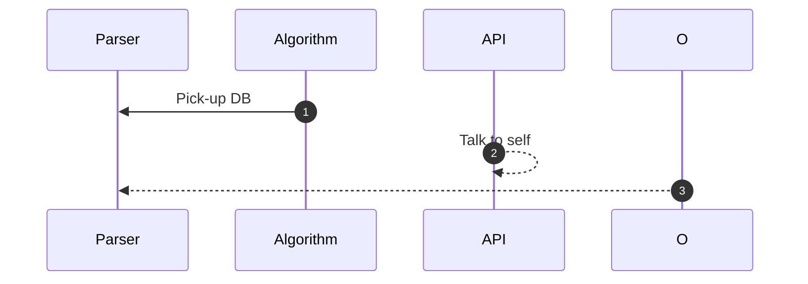

# FrequentPatterns.jl
Julia package for frequent patterns mining.

Will implement FP Growth as the first algorithm.

Things to consider

* Use Apache Arrow under the hood
* Rework the whole architecture :-)

