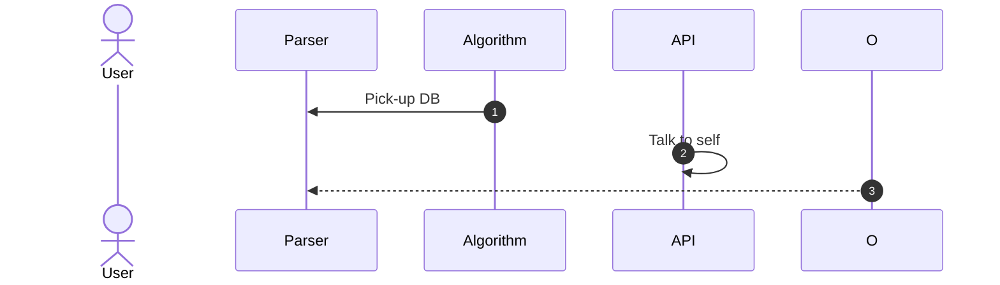

# FrequentPatterns.jl
Julia package for frequent patterns mining (FPM) as used in Market Basket
Analysis or recommender systems.

Support for these algorithms is planned:
* Apriori
* ECLAT
* FP Growth
* Recursive Elimination

The current architecture requires the user to make informed choices for the
format of the data so it fits with the requirements for the selected algorithm.

Things to consider

* Use Apache Arrow under the hood
* Rework the whole architecture to allow a higher degree of automation :-)
