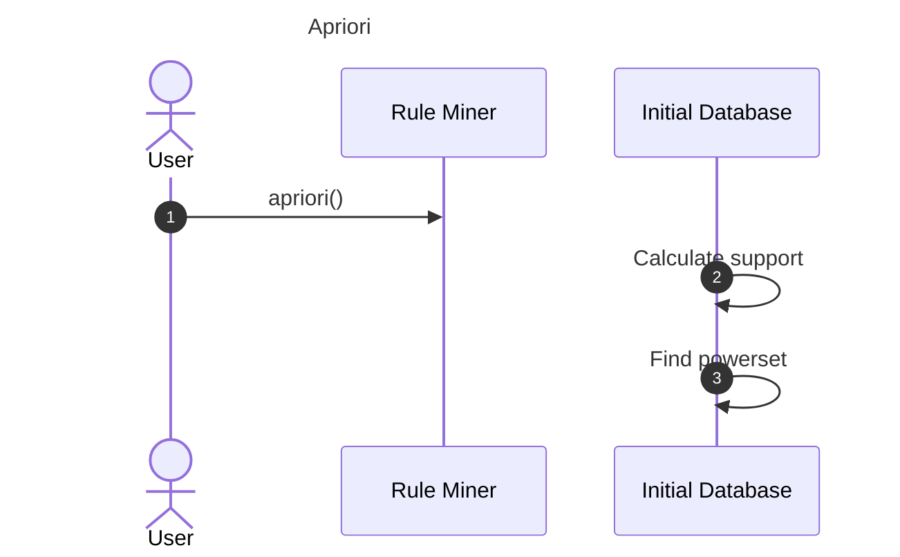

```mermaid
sequenceDiagram
    autonumber
    title Apriori

    actor u as User
    participant rm as Rule Miner
    participant idb as Initial Database

    u ->> rm : apriori()
    idb ->> idb : Calculate support
    idb ->> idb : Find powerset
```

For apriori we get both support and lift

$$
lift = \frac{P(X \cap Y)}{P(X)*P(Y)}
$$