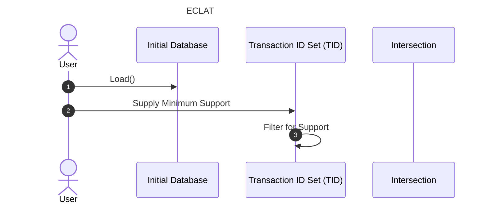

How the bits and pieces tie together in the FrequentPatterns.jl package.

Article on ECLAT algorithm https://medium.com/p/8ae3276d2d17

Considering the reliance on set intersections, it makes sense to use Sets in
Julia to accomplish this.