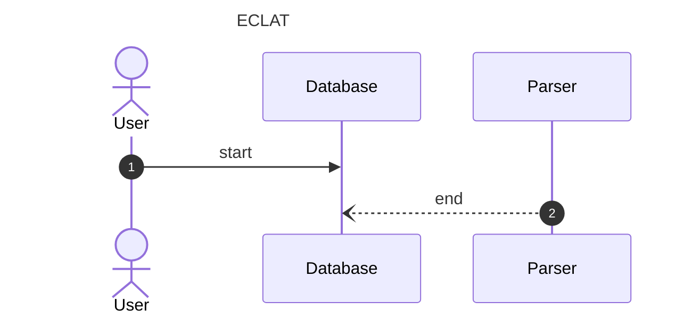

# ECLAT
The ECLAT algorithm is the best known of the set combination algorithms for
mining association rules. The interface in FrequentPatterns.jl follow the same
simple template as all the other algorithms:

1. Prepare data
2. Mine rules
3. Query rules

Since the collection of rules generated in step 2 support the DataTables
interface, the last step can be done using a wide variety of solutions that
run on top of this interface.

## Implementation
The ECLAT algorithm has been implemented using a brute force approach to the
generation of sets to consider and currently has no optimisations to ignore
combinations that contain infrequent subsets.

