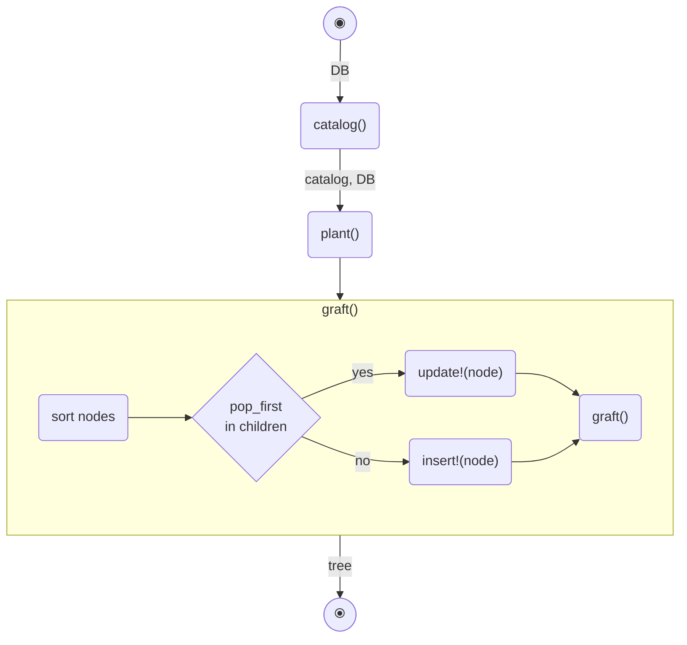
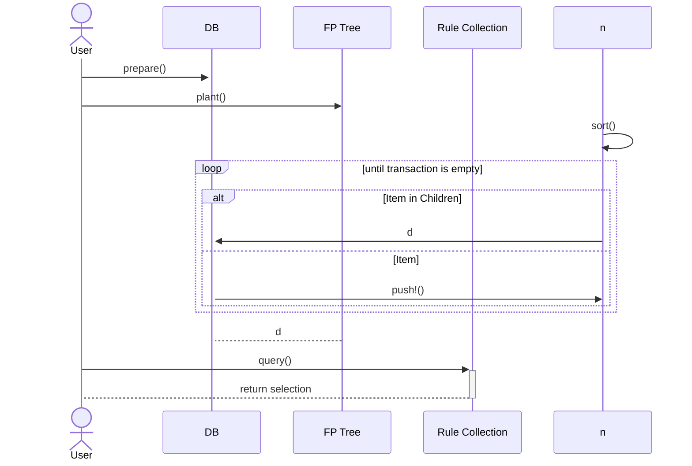

# FP growth

## Build the tree

### How to process a transaction
1. Sort in decending order of support
2. Point to root node
3. Loop over content of transaction while not empty
    - If the current item is in the children of the current node, update the
      count and move to the relevant child node.
    - If not, insert the item as a child node and move to the relevant node.

### process(::Transaction)

Some random text

### Auxillary functions
* push!(::Node) _remember to import from Base_
* pop!(::Node) _to be used during pruning_
* append!(::Node) _no sure if needed_
